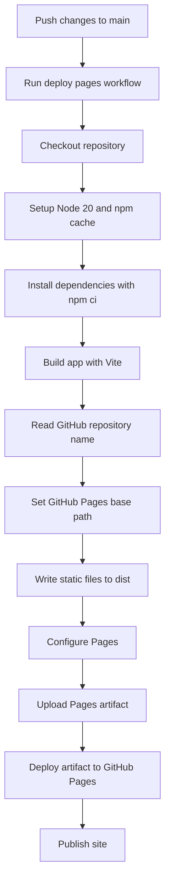
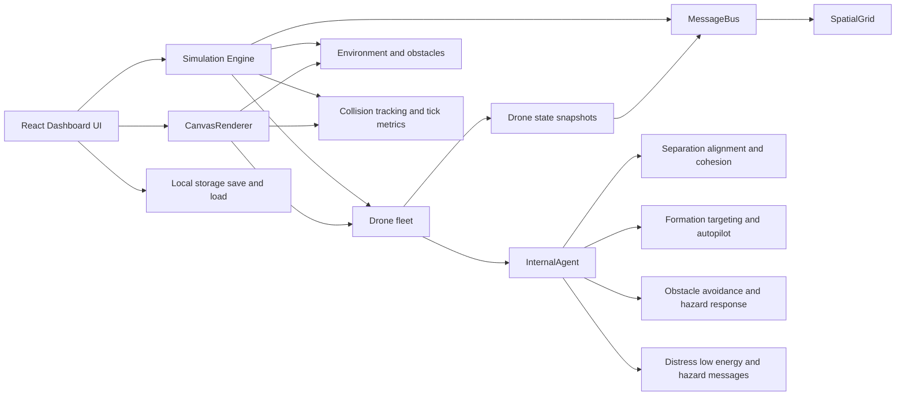
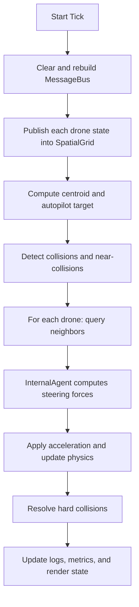

# Virtual Swarm Drone Coordination

An interactive React + TypeScript simulation for experimenting with coordinated drone swarm behavior, dynamic formations, obstacle avoidance, collision analysis, and mission-style waypoint control.

The app renders the swarm on a live canvas, exposes tuning controls through an operations dashboard, and models each drone as an autonomous agent that reacts to nearby peers, environmental hazards, and shared communication signals.

Live simulation: https://sayon999-d.github.io/Virtual-Swarm-Drone-Coordination/

## GitHub Pages Fixes Applied

The deployment issues were caused by missing GitHub Pages automation and by Vite building asset URLs as if the app were hosted from the domain root. On GitHub Pages project sites, the app is served from a repository subpath such as `/Virtual-Swarm-Drone-Coordination/`.

This repository has been updated to fix that:

- `vite.config.ts` now sets a repository-aware `base` path during GitHub Actions builds.
- `.github/workflows/deploy-pages.yml` now builds the site and deploys the `dist/` artifact to GitHub Pages.
- The workflow uses `npm ci`, Node.js 20, and the official Pages deploy actions for a predictable pipeline.

That combination prevents the common blank-page / missing-assets failure where the generated HTML points to `/assets/...` instead of `/<repo-name>/assets/...`.

## Deployment Pipeline



### Pipeline Explanation

1. A push to `main` triggers the Pages workflow.
2. GitHub Actions checks out the repository and installs dependencies with `npm ci`.
3. `npm run build` runs Vite. During that build, `vite.config.ts` detects the GitHub Actions environment and derives the repository name from `GITHUB_REPOSITORY`.
4. Vite sets the public base path to `/<repo-name>/`, which makes all generated JS, CSS, and asset references correct for a GitHub Pages project site.
5. The built output is stored in `dist/`, uploaded as a Pages artifact, and deployed through the official `deploy-pages` action.
6. GitHub Pages serves the published static site from the repository URL.

Expected Pages URL:

`https://sayon999-d.github.io/Virtual-Swarm-Drone-Coordination/`

## Runtime Architecture



### Architecture Explanation

The application is split into a few clear runtime layers:

1. `Dashboard.tsx`
   The control surface for the simulation. It manages the UI state for formations, behavior modes, obstacle selection, persistence, and inspection panels.

2. `CanvasRenderer.tsx`
   The live visualization layer. It renders drones, trails, hazards, hover states, and selection states onto a canvas while also handling interaction such as panning, zooming, and obstacle manipulation.

3. `Simulation.ts`
   The orchestration core. It owns the drone collection, environment, message bus, formation logic, autopilot waypoint flow, collision detection, export/import state, and per-tick update cycle.

4. `Drone.ts`
   The per-agent state container. Each drone tracks position, velocity, acceleration, energy, health, role profile, formation offset, and recent history used for rendering trails and behavioral feedback.

5. `InternalAgent.ts`
   The decision layer for autonomous motion. It combines flocking rules, obstacle avoidance, formation tracking, wander behavior, and message-driven reactions to produce the force vector applied to each drone on every tick.

6. `MessageBus.ts` and `SpatialGrid.ts`
   The neighbor-awareness layer. Instead of every drone scanning the full fleet, drone state is published into a spatial index so nearby agents can be queried efficiently. This keeps local perception and communication scalable.

7. `Environment.ts`
   The hazard model. Obstacles such as circular barriers, rectangles, electrical storms, and magnetic fields are stored here and fed into the agent decision system.

8. Browser `localStorage`
   The persistence layer used by the dashboard for quick save and load of simulation state, including swarm configuration, drone state, environment hazards, and autopilot waypoints.

## Core Behavior Model

Each simulation tick follows this general sequence:



### What the agents optimize for

- `Separation`: avoid crowding and direct overlap.
- `Alignment`: align velocity with nearby neighbors.
- `Cohesion`: keep the swarm connected.
- `Formation Targeting`: pull each drone toward its assigned slot or active target.
- `Obstacle Avoidance`: steer away from hazards and environmental obstacles.
- `Communication`: react to distress, low-energy, and hazard-detection broadcasts from nearby drones.
- `Profile Tuning`: vary movement behavior for `Scout`, `Defender`, `Worker`, and `Relay` drones.

## Feature Summary

- Real-time swarm visualization on canvas
- Formation modes including `Flock`, `Grid`, `V-Shape`, `Circle`, `Leader`, `Scatter`, `Hexagon`, and `Cross`
- Auto-pilot waypoint routing
- Collision and near-collision tracking
- Obstacle editing and hazard simulation
- Local save/load of mission state
- Role-based drone behavior profiles
- Adjustable movement and flocking controls

## What This Simulation Actually Demonstrates

This project is more than a particle animation. It simulates a fleet of autonomous drones that continuously balance local and global goals.

- Each drone tries to avoid nearby collisions.
- Each drone tries to align with neighbors and remain part of the group.
- Each drone can be pulled toward a formation slot or mission target.
- Each drone reacts to environmental hazards and local status messages.
- The full swarm adapts in real time as you change formation, density, obstacle layout, or behavior mode.

That combination makes the app useful for demonstrating how decentralized agents can create stable large-scale motion without a single rigid controller micromanaging every step.

## How To Use The Simulation

The simulation is designed to be explored interactively through the dashboard.

1. Start with a moderate drone count such as `30` to `60`.
2. Switch between formations like `Grid`, `Circle`, or `Hexagon` to see how slot assignment changes the swarm shape.
3. Increase or decrease `Spacing` to observe how tight formations affect stability and collision pressure.
4. Change the drone count to test how the same control parameters behave at different swarm densities.
5. Add obstacles and move them around the scene to see how the swarm reroutes under disturbance.
6. Enable auto-pilot to make the centroid follow a waypoint route instead of simply orbiting around its current state.
7. Save a state, modify the environment, then reload it to compare outcomes repeatably.

The app is most interesting when you intentionally push it into unstable conditions and then use the controls to recover order.

## Control Surface Explanation

The dashboard is effectively an operator console for the swarm engine.

- `Formation Matrix`
  Chooses the geometric arrangement of the drones. Structured formations assign each drone a relative slot around the swarm centroid.

- `Spacing`
  Controls the desired distance between formation slots. Larger values reduce packing pressure but make formations looser and slower to consolidate.

- `Drone Count`
  Recreates the simulation with a new fleet size. This is useful for testing how well the same steering rules scale as the swarm grows.

- `Save Current` and `Load Stored`
  Persist the current mission snapshot in browser `localStorage`, including drone positions, obstacle layout, formation mode, and route state.

- `Auto Pilot`
  Makes the swarm target a waypoint loop instead of only using the current centroid as its reference point.

- `Behavior`
  Changes the high-level steering balance by adjusting speed, force, separation, cohesion, and wander weights.

- `Obstacle Tools`
  Let you inject hazards directly into the environment to test avoidance, crowding, and recovery behavior.

## Formation System In Detail

The formation logic is one of the most important parts of the simulation.

For structured formations, the simulation first generates a list of ideal relative slot positions. Those slots are then centered around the swarm reference point and assigned to drones using a nearest-slot style matching pass. This is much more stable than naively sorting drones and placing them by index, because it reduces sudden role swapping when the formation changes.

The available formation modes represent different coordination patterns:

- `Scatter`
  Removes strong target-seeking and lets the swarm behave more like a loose roaming group.

- `Flock`
  Emphasizes classic flocking behavior with minimal rigid slot pressure.

- `Grid`
  Creates a dense, easily readable arrangement that is useful for comparing spacing and collision behavior.

- `Circle`
  Places drones around a ring, making it easy to observe angular spacing and convergence.

- `V-Shape`
  Creates a leader-front layout similar to migration or escort-style motion.

- `Leader`
  Stacks drones into a line behind a lead direction, which stresses follow behavior.

- `Hexagon`
  Produces a compact packing pattern that is especially useful for large groups.

- `Cross`
  Splits the swarm along diagonals and makes disturbance propagation visually obvious.

The formation system also adjusts spacing dynamically based on swarm size so large groups do not collapse into chronic overlap.

## Drone Roles And Behavioral Profiles

Each drone belongs to one of four profiles, and each profile modifies the base steering system in a different way.

- `Scout`
  Faster, more exploratory, and more sensitive to hazards. Scouts are the wide-perception units that notice trouble early, but they consume more energy and are less durable.

- `Defender`
  Slower but stronger and more resilient. Defenders react more heavily to distress and local protection behavior.

- `Worker`
  Efficient and formation-focused. Workers are better at settling into assigned slots and spend less effort on wandering.

- `Relay`
  Communication-oriented units that react strongly to the swarm message system and improve local coordination.

Because these profiles share the same world and interact through the same neighbor graph, the swarm develops mixed behavior instead of acting like a set of identical particles.

## Steering Model And Physics

Each tick, the engine computes a steering vector for every drone by combining several forces:

- `Separation`
  Pushes drones away from nearby neighbors when they get too close.

- `Alignment`
  Encourages similar heading and velocity within a local neighborhood.

- `Cohesion`
  Pulls a drone back toward the local group center.

- `Formation Target`
  Pulls a drone toward its assigned slot or the current mission target.

- `Obstacle Avoidance`
  Applies repulsion around hazards and obstacles.

- `Wander`
  Adds a controlled amount of randomness so the system does not look mechanically locked.

- `Communication Response`
  Lets drones react to distress, low-energy, and hazard-detection messages from nearby peers.

The simulation then integrates those forces into velocity, applies damping, limits speed and force, and updates position and orientation. This is why the movement feels like a soft autonomous system instead of immediate grid snapping.

## Communication And Neighbor Search

The app uses a local message bus backed by a spatial grid.

Instead of making every drone compare itself against every other drone every frame, each drone publishes a snapshot of its current state into the `SpatialGrid`. Neighbor queries then only inspect nearby cells rather than the full fleet.

That matters for two reasons:

1. It keeps the simulation closer to decentralized reasoning, because each agent only reacts to local context.
2. It improves scalability, because local neighborhood lookup is much cheaper than full pairwise comparison as drone count increases.

Each published state can also carry lightweight messages such as:

- `DISTRESS`
- `LOW_ENERGY`
- `HAZARD_DETECTED`

Those messages let drones influence one another without introducing a heavy centralized command layer.

## Obstacles And Hazard Modeling

The environment supports multiple obstacle types, each with a slightly different visual and behavioral character.

- `circle`
  A basic radial keep-out zone.

- `rect`
  A box-shaped obstacle that is useful for corridor and edge-routing tests.

- `electrical_storm`
  A hazard-style zone used to represent more volatile interference.

- `magnetic_field`
  A field-based obstacle that visually and behaviorally suggests steering distortion.

Obstacle intensity and size influence how strongly drones are repelled and how often they fall into unstable, collision-prone states near the hazard boundary.

## Collision Detection, Stability, And Recovery

The simulation does not only render collisions after the fact; it actively tries to predict and recover from instability.

- Near-collision checks identify dangerous crowding before direct overlap happens.
- Hard-collision detection records actual contacts and visual events.
- Local multipliers increase separation pressure when a drone becomes unstable or crowded.
- Formation pressure can increase when a drone drifts too far from its assigned slot.
- Collision resolution pushes overlapping drones apart and adjusts velocity to reduce sticking and jitter.

This makes the swarm feel self-correcting under pressure rather than permanently chaotic once disturbed.

## State Persistence And Repeatable Scenarios

One underrated feature of the app is state export and import through browser storage.

When you save a mission snapshot, the simulation stores:

- current tick and formation
- behavior mode and spacing
- movement configuration
- autopilot waypoints and active waypoint index
- environment hazards
- drone positions, velocity, energy, health, profile, and target offset

That makes it easy to create repeatable test cases for demos, tuning sessions, or side-by-side comparisons of different swarm settings.

## Practical Experiments To Try

If you want to understand the system quickly, these are good experiments:

1. Start in `Scatter`, then switch to `Hexagon` and watch how quickly the group consolidates.
2. Increase drone count while keeping spacing low to see when collision pressure begins to rise.
3. Place an `electrical_storm` directly on the route and observe how different role profiles react.
4. Run auto-pilot with a structured formation, then add obstacles near a waypoint to see how the centroid and slot pressures compete.
5. Save a stable state, create a hostile obstacle field, and reload the original state to compare recovery behavior cleanly.

## Project Structure

```text
src/
  App.tsx
  main.tsx
  index.css
  swarm/
    agents/            # Drone state and physics-facing entity logic
    communication/     # Local message passing
    control/           # Shared swarm configuration
    environment/       # Obstacle and hazard definitions
    internal_agent/    # Steering and decision logic
    simulation/        # Core orchestrator
    spatial_index/     # Neighbor lookup optimization
    utils/             # Vector math
    visualization/     # Dashboard and canvas renderer
```

## Local Development

### Prerequisites

- Node.js 20+ recommended
- npm

### Run locally

```bash
npm ci
npm run dev
```

By default the Vite dev server runs at:

`http://localhost:3000`

## GitHub Pages Deployment

### Repository settings

In GitHub, open:

`Settings -> Pages -> Build and deployment -> Source`

Set the source to:

`GitHub Actions`

### Deploy flow

After the Pages source is set to GitHub Actions:

1. Push changes to `main`.
2. Wait for the `Deploy to GitHub Pages` workflow to complete.
3. Open the published site URL.

## Files Updated for the Fix

- [`vite.config.ts`](./vite.config.ts)
- [`.github/workflows/deploy-pages.yml`](./.github/workflows/deploy-pages.yml)
- [`README.md`](./README.md)

## Verification Notes

The repository changes now match the correct GitHub Pages deployment model for a Vite project site. A full local build verification still requires dependency installation in the workspace with:

```bash
npm ci
npm run build
```

Once those commands succeed, the generated `dist/` output is what the GitHub Pages workflow publishes.
