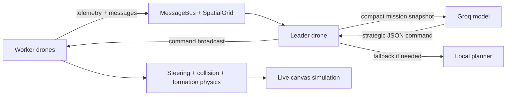

# Virtual Swarm Drone Coordination

🛸 **Virtual Swarm Drone Coordination** is an interactive React + TypeScript simulation for experimenting with multi-agent drone behavior, formation control, hazard avoidance, leader-worker coordination, and AI-assisted mission planning.

Live simulation: https://sayon999-d.github.io/Virtual-Swarm-Drone-Coordination/

> Note: the GitHub Pages build is a static deployment. The Groq-backed leader route is available when running the Vite dev server or a server deployment that can keep `GROQ_API_KEY` private.

## ✨ What Makes This Different

Most browser drone demos are visual flocking sketches: particles move, avoid each other, and maybe follow a target. This project is designed as a **swarm coordination lab** instead.

- 🧠 **Leader brain + worker agents**
  One drone acts as the commander. It reads telemetry from the rest of the swarm, decides the next high-level command, and broadcasts that command back to the fleet.

- ⚡ **Groq-first planning with local fallback**
  The leader can ask a Groq-hosted model for high-level mission decisions. If the API key is missing, rate-limited, or unavailable, the local planner keeps the swarm alive without freezing the simulation.

- 📡 **Visible agent communication**
  The Leader panel shows what worker drones are trying to tell the commander: status reports, low energy alerts, hazard warnings, and distress messages.

- 🧩 **Hybrid control model**
  The model does not micromanage drone physics. Groq chooses strategic commands such as `REGROUP`, `AVOID_HAZARDS`, or `CONSERVE_ENERGY`; the simulation handles steering, force limits, collision prevention, and slot settling.

- 🧭 **Formation-aware stability**
  Formations use safe spacing, slot assignment, near-slot braking, separation pressure, and overlap recovery so drones do not simply snap into unrealistic positions.

- 🧱 **Hazard-rich environment**
  Obstacles are not just drawings. Electrical storms, magnetic fields, blocks, and pillars affect routing, energy, health, collision pressure, and communications.

- 🛰️ **Scalable local perception**
  Drones query nearby agents through a spatial grid instead of scanning the whole swarm each frame, making the behavior closer to decentralized local awareness.

## 🧠 System Concept



The important split is:

- 🧠 **Groq / leader planner:** strategic reasoning
- 🛠️ **Simulation engine:** motion, collision, hazards, formation settling
- 📡 **Worker drones:** local sensing, local steering, message reporting

That makes the project closer to an **AI-commanded swarm system** than a simple animation.

## 🚁 Core Features

- 🎮 Real-time canvas simulation
- 🧠 Leader drone with Groq-first / local-fallback planner
- 📡 Worker-to-leader communication feed
- 🧱 Dynamic hazards: pillars, blocks, electrical storms, magnetic fields
- 🧭 Formations: `Flock`, `Grid`, `V-Shape`, `Circle`, `Leader`, `Scatter`, `Hexagon`, `Cross`
- 🛡️ Collision and near-collision detection
- 🧩 Role profiles: `Scout`, `Defender`, `Worker`, `Relay`
- 🗺️ Auto-pilot waypoint patrol
- 💾 Local save/load for repeatable mission snapshots
- 🔍 Drone inspector with energy, health, role, speed, and telemetry stream
- 🧪 Tunable steering weights for separation, alignment, and cohesion

## 🧬 Drone Roles

Each drone has a profile that changes how it behaves inside the same world.

| Role | Purpose | Behavior |
| --- | --- | --- |
| 🔎 `Scout` | Explore and detect hazards | Faster, wider perception, more energy use |
| 🛡️ `Defender` | Protect and stabilize | Slower, stronger separation, higher health |
| 🔧 `Worker` | Hold formation | Efficient, slot-focused, low wander |
| 📡 `Relay` | Improve coordination | Stronger response to communication signals |

The leader drone is assigned as a `Relay` so it naturally fits the communication-heavy role.

## 🧠 Leader Brain

The leader planner produces one of these mission commands:

| Command | Meaning |
| --- | --- |
| `HOLD_FORMATION` | Keep current slot assignments stable |
| `REGROUP` | Pull drones toward the commander/centroid |
| `EXPAND_SEARCH` | Let Scouts widen coverage |
| `AVOID_HAZARDS` | Prioritize obstacle avoidance and safer routing |
| `CONSERVE_ENERGY` | Reduce wasteful motion and protect low-energy drones |

### Groq Primary, Local Fallback

Groq is treated as the **main strategic brain**, but the local planner is always available.

The runtime flow is:

1. Worker drones publish telemetry.
2. The leader builds a compact planning snapshot.
3. `/api/leader-plan` sends the snapshot to Groq using the server-side `GROQ_API_KEY`.
4. Groq returns compact JSON.
5. If Groq fails or hits rate limits, the local planner issues a fallback command.
6. The leader broadcasts the active command to the swarm.

### Groq Environment Variables

Create a local `.env` file:

```env
GROQ_API_KEY="your_groq_api_key"
GROQ_MODEL="llama-3.1-8b-instant"
```

Recommended model:

- `llama-3.1-8b-instant` for lower token usage and fewer rate-limit issues

The older/larger `llama-3.3-70b-versatile` can work, but it is easier to hit TPM limits on the on-demand tier.

## 📡 Agent Communication Feed

The Leader panel includes an **Agent Communications** section near the top of the panel. It shows what worker drones are reporting:

- `STATUS_REPORT`: routine energy, health, and slot-error updates
- `LOW_ENERGY`: drone requests energy-aware routing
- `DISTRESS`: drone reports low health
- `HAZARD_DETECTED`: drone warns the leader about nearby danger
- `LEADER_COMMAND`: commander broadcast visible through the message system

This makes the simulation easier to explain: you can see the worker agents sending data, the leader deciding, and the swarm reacting.

## 🧭 Formation System

Structured formations assign each drone to a relative slot around the swarm center. The system avoids naive index-based placement and instead assigns slots by nearest available drone to reduce abrupt role swapping.

Formation stability includes:

- safe formation spacing
- higher separation pressure in formation mode
- near-slot braking for all drone roles
- overlap resolution after movement
- damping and lower wander during formation settling
- visual formation guide overlays

This is why the drones can form a V-shape or grid while still behaving like autonomous vehicles rather than instantly teleporting into place.

## 🧱 Hazards And Obstacles

| Hazard | Effect |
| --- | --- |
| 🔴 `circle` | Basic radial keep-out pillar |
| ◼️ `rect` | Block/corridor obstacle |
| ⚡ `electrical_storm` | Damages health and creates unstable movement |
| 🧲 `magnetic_field` | Drains energy and slows drones |

Hazards influence local avoidance, message generation, collision risk, and leader decisions.

## 🏗️ Runtime Architecture

```mermaid
flowchart TD
    UI[Dashboard UI] --> Sim[Simulation Engine]
    UI --> Canvas[CanvasRenderer]
    Sim --> Fleet[Drone Fleet]
    Sim --> Env[Environment]
    Sim --> Bus[MessageBus]
    Bus --> Grid[SpatialGrid]
    Fleet --> Agent[InternalAgent]
    Fleet --> Telemetry[Drone Telemetry]
    Telemetry --> Leader[LeaderAgent]
    Leader --> GroqRoute[/api/leader-plan]
    GroqRoute --> Groq[Groq Chat Completions]
    Leader --> Commands[Leader Commands]
    Commands --> Fleet
    Sim --> Logs[Collision + Communication Logs]
```

## 📁 Project Structure

```text
src/
  App.tsx
  main.tsx
  index.css
  swarm/
    agents/            # Drone state and physics-facing entity logic
    communication/     # Message bus
    control/           # Shared swarm configuration
    environment/       # Obstacles and hazards
    internal_agent/    # Per-drone steering brain
    leader/            # Groq-first leader planner and fallback logic
    simulation/        # Core orchestrator
    spatial_index/     # Neighbor lookup optimization
    utils/             # Vector math
    visualization/     # Dashboard and canvas renderer
```

## 🧪 Local Development

### Requirements

- Node.js 20+
- npm
- Optional: Groq API key for model-backed leader decisions

### Install

```bash
npm ci
```

### Run

```bash
npm run dev
```

Vite usually starts at:

```text
http://localhost:3000/
```

If ports are already in use, Vite will choose `3001`, `3002`, and so on.

### Validate

```bash
npm run lint
npm run build
```

## 🚀 GitHub Pages Deployment

This repository deploys the static app through GitHub Actions.

Required Pages setting:

```text
Settings -> Pages -> Build and deployment -> Source -> GitHub Actions
```

Deployment flow:

1. Push to `main`.
2. GitHub Actions installs dependencies.
3. TypeScript checks run with `npm run lint`.
4. Vite builds the app with the correct repository base path.
5. The `dist/` artifact is uploaded to GitHub Pages.
6. Pages publishes the site.

## ⚙️ Workflow

The workflow lives at:

```text
.github/workflows/deploy-pages.yml
```

It handles:

- ✅ pull request validation
- ✅ dependency installation with `npm ci`
- ✅ TypeScript checks
- ✅ production build
- ✅ GitHub Pages artifact upload
- ✅ deployment from `main`

## 🧪 Experiments To Try

1. Switch from `Scatter` to `V-Shape` and watch the slot assignment settle.
2. Add an `electrical_storm` near the leader and observe hazard messages.
3. Lower energy by placing magnetic fields, then watch `CONSERVE_ENERGY` decisions.
4. Open the Leader panel and watch worker drones report status to the commander.
5. Enable Groq mode and compare Groq decisions against local fallback behavior.
6. Increase drone count and tune spacing to see when formations become unstable.

## 🧾 Why This Matters

This simulation is useful for demonstrating:

- hierarchical multi-agent coordination
- local perception with global strategy
- LLM-assisted command planning
- fallback-safe AI control loops
- swarm stability under obstacles and communication pressure
- visual explainability for agent-to-agent messaging

It is not just “drones moving around.” It is a compact testbed for thinking about how autonomous units can report local reality to a leader, receive a mission-level command, and still preserve local safety.

