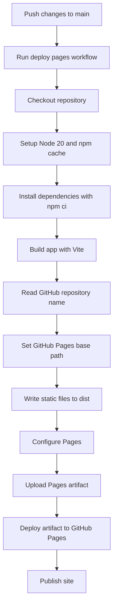
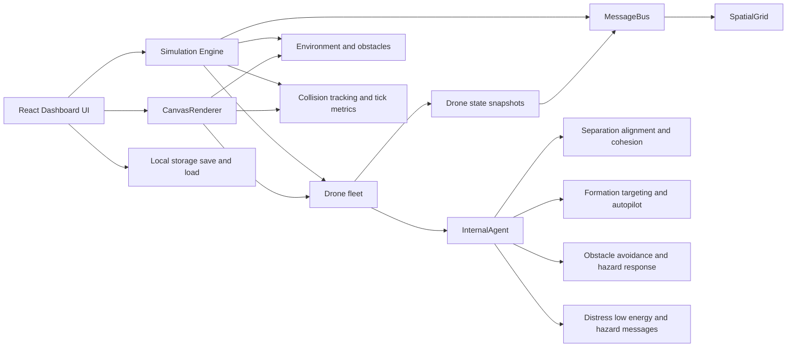
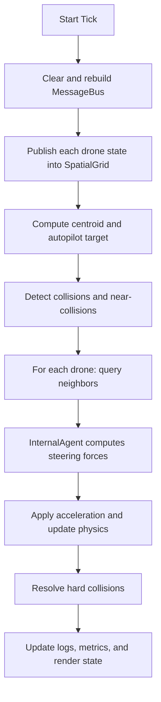

# Virtual Swarm Drone Coordination

An interactive React + TypeScript simulation for experimenting with coordinated drone swarm behavior, dynamic formations, obstacle avoidance, collision analysis, and mission-style waypoint control.

The app renders the swarm on a live canvas, exposes tuning controls through an operations dashboard, and models each drone as an autonomous agent that reacts to nearby peers, environmental hazards, and shared communication signals.

Live simulation: https://sayon999-d.github.io/Virtual-Swarm-Drone-Coordination/

## GitHub Pages Fixes Applied

The deployment issues were caused by missing GitHub Pages automation and by Vite building asset URLs as if the app were hosted from the domain root. On GitHub Pages project sites, the app is served from a repository subpath such as `/Virtual-Swarm-Drone-Coordination/`.

This repository has been updated to fix that:

- `vite.config.ts` now sets a repository-aware `base` path during GitHub Actions builds.
- `.github/workflows/deploy-pages.yml` now builds the site and deploys the `dist/` artifact to GitHub Pages.
- The workflow uses `npm ci`, Node.js 20, and the official Pages deploy actions for a predictable pipeline.

That combination prevents the common blank-page / missing-assets failure where the generated HTML points to `/assets/...` instead of `/<repo-name>/assets/...`.

## Deployment Pipeline



### Pipeline Explanation

1. A push to `main` triggers the Pages workflow.
2. GitHub Actions checks out the repository and installs dependencies with `npm ci`.
3. `npm run build` runs Vite. During that build, `vite.config.ts` detects the GitHub Actions environment and derives the repository name from `GITHUB_REPOSITORY`.
4. Vite sets the public base path to `/<repo-name>/`, which makes all generated JS, CSS, and asset references correct for a GitHub Pages project site.
5. The built output is stored in `dist/`, uploaded as a Pages artifact, and deployed through the official `deploy-pages` action.
6. GitHub Pages serves the published static site from the repository URL.

Expected Pages URL:

`https://sayon999-d.github.io/Virtual-Swarm-Drone-Coordination/`

## Runtime Architecture



### Architecture Explanation

The application is split into a few clear runtime layers:

1. `Dashboard.tsx`
   The control surface for the simulation. It manages the UI state for formations, behavior modes, obstacle selection, persistence, and inspection panels.

2. `CanvasRenderer.tsx`
   The live visualization layer. It renders drones, trails, hazards, hover states, and selection states onto a canvas while also handling interaction such as panning, zooming, and obstacle manipulation.

3. `Simulation.ts`
   The orchestration core. It owns the drone collection, environment, message bus, formation logic, autopilot waypoint flow, collision detection, export/import state, and per-tick update cycle.

4. `Drone.ts`
   The per-agent state container. Each drone tracks position, velocity, acceleration, energy, health, role profile, formation offset, and recent history used for rendering trails and behavioral feedback.

5. `InternalAgent.ts`
   The decision layer for autonomous motion. It combines flocking rules, obstacle avoidance, formation tracking, wander behavior, and message-driven reactions to produce the force vector applied to each drone on every tick.

6. `MessageBus.ts` and `SpatialGrid.ts`
   The neighbor-awareness layer. Instead of every drone scanning the full fleet, drone state is published into a spatial index so nearby agents can be queried efficiently. This keeps local perception and communication scalable.

7. `Environment.ts`
   The hazard model. Obstacles such as circular barriers, rectangles, electrical storms, and magnetic fields are stored here and fed into the agent decision system.

8. Browser `localStorage`
   The persistence layer used by the dashboard for quick save and load of simulation state, including swarm configuration, drone state, environment hazards, and autopilot waypoints.

## Core Behavior Model

Each simulation tick follows this general sequence:



### What the agents optimize for

- `Separation`: avoid crowding and direct overlap.
- `Alignment`: align velocity with nearby neighbors.
- `Cohesion`: keep the swarm connected.
- `Formation Targeting`: pull each drone toward its assigned slot or active target.
- `Obstacle Avoidance`: steer away from hazards and environmental obstacles.
- `Communication`: react to distress, low-energy, and hazard-detection broadcasts from nearby drones.
- `Profile Tuning`: vary movement behavior for `Scout`, `Defender`, `Worker`, and `Relay` drones.

## Feature Summary

- Real-time swarm visualization on canvas
- Formation modes including `Flock`, `Grid`, `V-Shape`, `Circle`, `Leader`, `Scatter`, `Hexagon`, and `Cross`
- Auto-pilot waypoint routing
- Collision and near-collision tracking
- Obstacle editing and hazard simulation
- Local save/load of mission state
- Role-based drone behavior profiles
- Adjustable movement and flocking controls

## Project Structure

```text
src/
  App.tsx
  main.tsx
  index.css
  swarm/
    agents/            # Drone state and physics-facing entity logic
    communication/     # Local message passing
    control/           # Shared swarm configuration
    environment/       # Obstacle and hazard definitions
    internal_agent/    # Steering and decision logic
    simulation/        # Core orchestrator
    spatial_index/     # Neighbor lookup optimization
    utils/             # Vector math
    visualization/     # Dashboard and canvas renderer
```

## Local Development

### Prerequisites

- Node.js 20+ recommended
- npm

### Run locally

```bash
npm ci
npm run dev
```

By default the Vite dev server runs at:

`http://localhost:3000`

## GitHub Pages Deployment

### Repository settings

In GitHub, open:

`Settings -> Pages -> Build and deployment -> Source`

Set the source to:

`GitHub Actions`

### Deploy flow

After the Pages source is set to GitHub Actions:

1. Push changes to `main`.
2. Wait for the `Deploy to GitHub Pages` workflow to complete.
3. Open the published site URL.

## Files Updated for the Fix

- [`vite.config.ts`](./vite.config.ts)
- [`.github/workflows/deploy-pages.yml`](./.github/workflows/deploy-pages.yml)
- [`README.md`](./README.md)

## Verification Notes

The repository changes now match the correct GitHub Pages deployment model for a Vite project site. A full local build verification still requires dependency installation in the workspace with:

```bash
npm ci
npm run build
```

Once those commands succeed, the generated `dist/` output is what the GitHub Pages workflow publishes.
